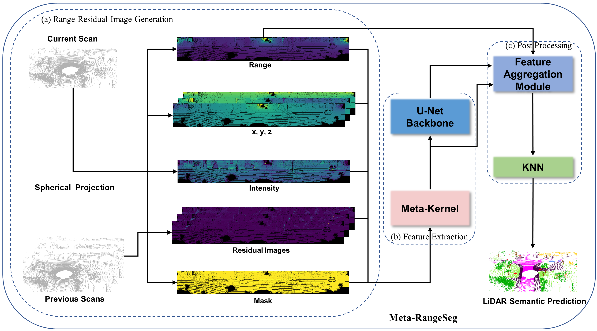
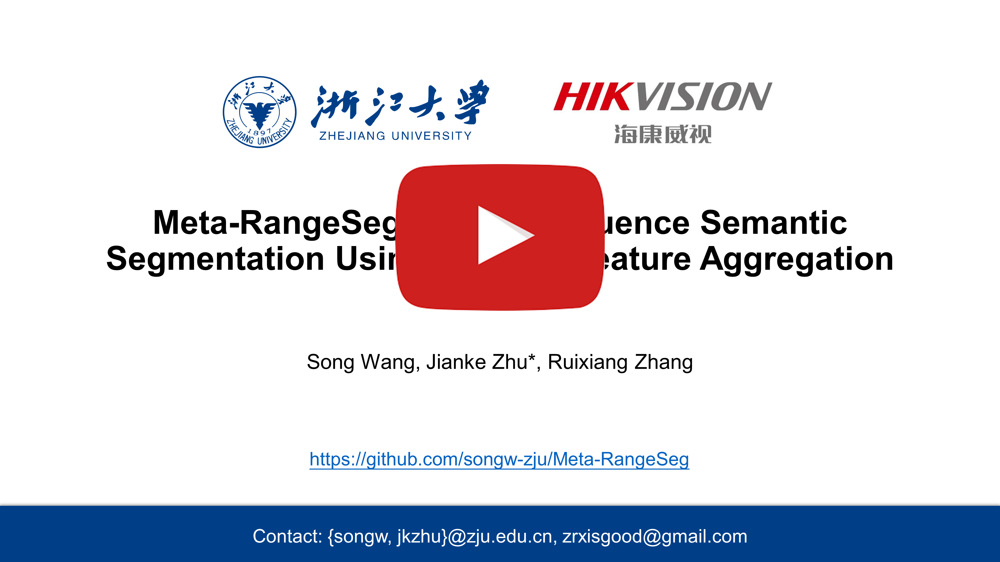

# Meta-RangeSeg
This is the official implementation of **Meta-RangeSeg: LiDAR Sequence Semantic Segmentation Using Multiple Feature Aggregation**  [[Paper](https://arxiv.org/pdf/2202.13377.pdf)] [[Video](https://youtu.be/xUFsmmjZYuA)]. [](https://arxiv.org/abs/2202.13377) 	
[](https://paperswithcode.com/sota/3d-semantic-segmentation-on-semantickitti?p=meta-rangeseg-lidar-sequence-semantic)

<p align="center"> <a></a> </p>

|                      | **Prediction**              | **Groud Truth**        |
| -------------------- | --------------------------- | ---------------------- |
| **Perspective View** |  |  |
| **Birds-Eye View**   |    |    |

## Demo
<p align="center"> <a href="https://youtu.be/xUFsmmjZYuA"></a> </p>


## Model Zoo
| Model  | Task   | mIoU(paper)[on test set] | mIoU(reprod.)[on test set] | Results |
| :----------------: | :----------------: | :----------------: | :----------------: | :----------------: |
| [Meta-RangeSeg_v1](https://drive.google.com/file/d/1vq1fP6MjXIYZTnW6jhAAMfidKJCuZ3Zl/view?usp=sharing) | **multiple scans** semantic segmentation | 49.5 | 49.7 | [valid_pred](https://drive.google.com/file/d/1yMFevZtoZcaYZ6F6dtONKIwT9QXgSTyf/view?usp=sharing) |


## Abstract
LiDAR sensor is essential to the perception system in autonomous vehicles and intelligent robots. To fulfill the real-time requirements in real-world applications, it is necessary to efficiently segment the LiDAR scans. Most of previous approaches directly project 3D point cloud onto the 2D spherical range image so that they can make use of the efficient 2D convolutional operations for image segmentation. Although having achieved the encouraging results, the neighborhood information is not well-preserved in the spherical projection. Moreover, the temporal information is not taken into consideration in the single scan segmentation task. To tackle these problems, we propose a novel approach to semantic segmentation for LiDAR sequences named Meta-RangeSeg, where a novel range residual image representation is introduced to capture the spatial-temporal information. Specifically, Meta-Kernel is employed to extract the meta features, which reduces the inconsistency between the 2D range image coordinates input and Cartesian coordinates output. An efficient U-Net backbone is used to obtain the multi-scale features. Furthermore, Feature Aggregation Module (FAM) aggregates the meta features and multi-scale features, which tends to strengthen the role of range channel. We have conducted extensive experiments for performance evaluation on SemanticKITTI, which is the de-facto dataset for LiDAR semantic segmentation. The promising results show that our proposed Meta-RangeSeg method is more efficient and effective than the existing approaches.


## TO DO
This paper is under review currently. Code will be made publicly available soon!

- [x] Add pretrained model for multiple scans
- [ ] Add pretrained model for single scan
- [ ] Add code for inference
- [x] Add demo for Meta-RangeSeg
- [ ] Add full training code and results

## Citations
```
@misc{wang2022metarangeseg,
      title={Meta-RangeSeg: LiDAR Sequence Semantic Segmentation Using Multiple Feature Aggregation}, 
      author={Song Wang and Jianke Zhu and Ruixiang Zhang},
      year={2022},
      eprint={2202.13377},
      archivePrefix={arXiv},
      primaryClass={cs.CV}
}
```
